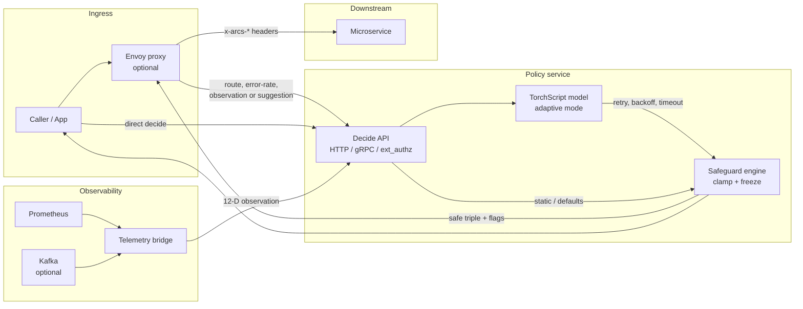

# ARCS

**Version 1** — Autonomous Retry Control System

Deep reinforcement learning for adaptive **retry**, **backoff**, and **timeout** policies in microservice architectures.

**Author:** W.A. Tharushi Kawodya

## What it is

ARCS learns safer retry/timeout rules for distributed services. A **policy service** sits beside your traffic path (for example Envoy `ext_authz`), takes route health and an optional suggested action (or a 12-D observation for ML), and returns a safeguarded `(retry, backoff_multiplier, timeout_ms)` decision.

## How it works



1. **Caller or proxy** sends a decide request with a route id, recent error rate, and either a suggested triple or a 12-float observation.
2. **Policy service** (HTTP + gRPC) runs shared decide logic:
   - If inference is enabled and an observation is present, a TorchScript model may propose the triple.
   - Otherwise it uses the caller’s suggested values (or safe defaults).
3. **Safeguard engine** clamps unsafe values, applies freeze rules under high error rates, and records override reasons.
4. **Response** returns the final triple plus flags such as `frozen_active` and `override_reasons`.
5. **Envoy** (optional) asks the policy service on each request and forwards headers like `x-arcs-retry` to downstream clients/apps.
6. **Telemetry bridge** (optional) builds the same 12-D observation from Prometheus (and optional Kafka) so adaptive mode can stay live.

Training and export live under `arcs-rl/` (`arcs-train`, `arcs-export`). Runtime serving is `services/policy-service/`.

## When to use it

Use ARCS when:

- Microservices retry or time out with **fixed** configs that fail under changing load or partial outages.
- You want **per-route** adaptive limits with hard safety bounds (not unbounded ML actions).
- You can provide **error-rate** (and optionally a 12-D state) at decide time, or run Envoy in front of a service.
- You need decisions over **HTTP JSON**, **gRPC** (`arcs.policy.v1.Policy/Decide`), or **Envoy ext_authz**.

Prefer **static / safeguard-only** mode (`benchmark-static` style config) when you do not have a trained TorchScript model yet. Use **adaptive** mode when `data/models/policy.ts` (or your configured model path) is available and observations are reliable.

Do **not** use Version 1 as a drop-in for every cluster without validation: start in a demo or staging stack, compare override rates and latency, then promote.

## Quick start (local demo)

```bash
make demo
```

Useful checks after the stack is up:

- Echo via Envoy: `curl -s 'http://127.0.0.1:10000/echo?message=hi' -H 'x-arcs-route: /echo' -H 'x-arcs-error-rate: 0.01'`
- Policy health: `curl -s http://127.0.0.1:18080/health/live`
- Prometheus: http://127.0.0.1:9090
- Grafana: http://127.0.0.1:3000 (admin / admin)

Policy image builds use the root [`.dockerignore`](.dockerignore). Compose context is the repo root (`services/policy-service/Dockerfile`).

## Version 1 scope

This release focuses on:

- Policy decide API (HTTP, gRPC, Envoy ext_authz)
- Safeguards + optional TorchScript inference
- Local Docker Compose demo stack and Helm chart under `infra/`

## License

MIT — see [LICENSE](LICENSE).
